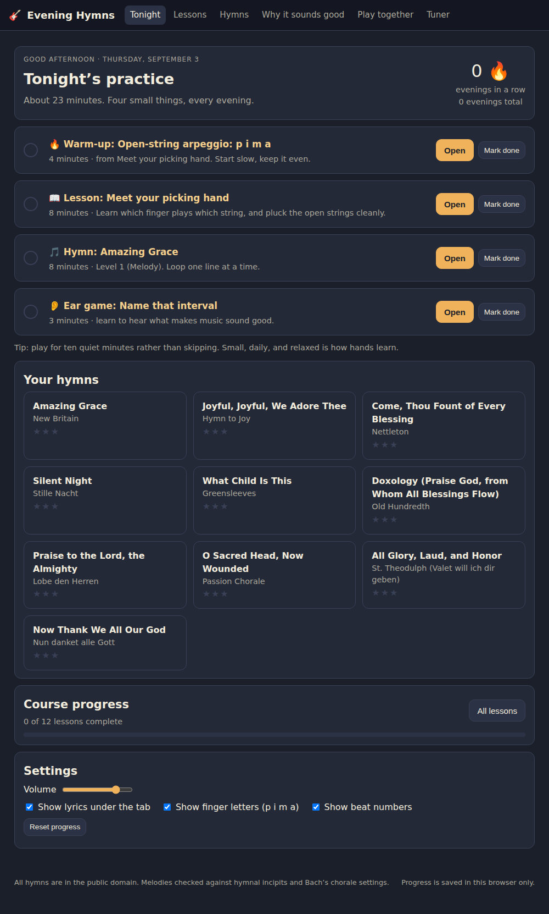
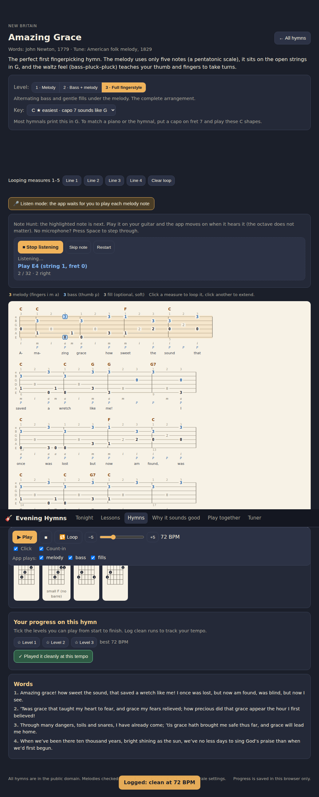
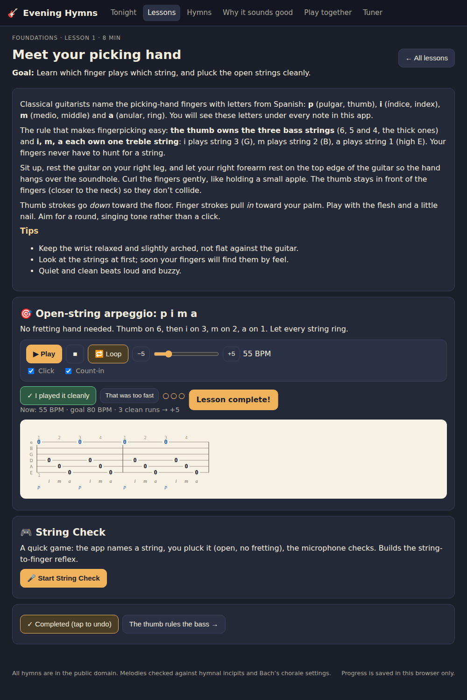

# Evening Hymns 🎸

A small, quiet app for learning to **fingerpick hymns on the guitar**, ten minutes at a time, every evening.
It runs entirely in your browser: no account, no install, no build step.

- **Tonight** – a four-item practice plan (warm-up, lesson, hymn, ear game) with a streak counter.
- **Lessons** – a 12-lesson fingerpicking course (thumb bass, i-m-a fingers, arpeggios, waltz and 6/8 patterns, alternating "Travis" bass, pinches, melody-on-top) with looping tab, a metronome and a tempo ladder (three clean runs → +5 BPM).
- **Hymns** – ten public-domain hymns, each auto-arranged for fingerstyle at three levels (melody only → bass + melody → full arrangement), in any key, with lyrics, chord diagrams, looping, a playhead, and a microphone "Note Hunt" mode that waits for you to play each melody note.
- **Why it sounds good** – nine interactive pages on notes, scales, intervals (with a waveform view of why fifths and thirds blend), chords, keys, cadences, harmony, meter and the circle of fifths, plus three ear-training games.
- **Play together** – capo tables for any key, harmonica positions (e.g. *"I have a G harmonica"*), transposing instruments (trumpet, clarinet, saxes, horn), ukulele chord names, and key-shifting for singers and flat-key hymnals.
- **Tuner** – a chromatic tuner with reference tones.

| Tonight | A hymn at Level 3 | A lesson |
|---|---|---|
|  |  |  |

## Run it

**Easiest:** open `index.html` in Chrome, Edge, Firefox or Safari. Everything is plain HTML/CSS/JS.

**On your phone or tablet (installable app):** the workflow in `.github/workflows/deploy.yml` publishes the site to the `gh-pages` branch on every push, and GitHub Pages serves it at
`https://farmerboy14.github.io/Guitar-Learning-App/`. If the page does not appear after the first run, open *Settings → Pages* once and choose *Deploy from a branch → gh-pages → / (root)*.

Open that address on your phone and add it to the home screen (Safari: Share → Add to Home Screen; Chrome: menu → Install app). It opens full screen and keeps working offline thanks to the service worker in `sw.js`; your progress stays on the device.

**Locally with a server** (only needed if your browser blocks the microphone on `file://`):

```bash
npm start          # serves the folder at http://localhost:8080 (needs Python 3)
```

The microphone features (tuner, String Check, Note Hunt) need a secure page: `https://…`, `localhost`, or a local file in Chrome.

## The evening routine

1. **Warm-up** with the pattern from the previous lesson (4 minutes). Loop it with the click.
2. **Lesson**: read, then play the exercise. Press *"I played it cleanly"* after each good run; after three the tempo rises.
3. **Hymn**: open the hymn the lesson points to. Level 1 first (just the tune), then Level 2 (thumb on beat one), then Level 3 (alternating bass and fills). Loop one line at a time.
4. **Ear game** for three minutes.

Mark each done (most of them tick themselves off when you log a clean run) and the streak grows.

## How the tab is made

Each hymn is stored as a melody with chord symbols in [ABC notation](https://abcnotation.com/wiki/abc:standard:v2.1). The arranger in `js/arranger.js`:

1. drops the hymnal (soprano) melody an octave into the guitar's range and places each note on the highest comfortable string in first position (a small Viterbi search keeps the hand still);
2. on every strong beat finds the chord's root on a bass string *below* the melody (Level 2), alternating to the fifth on the secondary beat (Level 3);
3. where the melody holds a note, adds a quiet chord tone on a middle string (Level 3, printed grey, optional);
4. assigns fingers: thumb (**p**) for strings 6–4, **i m a** for strings 3–1.

Choosing a different key re-runs the whole thing, and the app ranks all twelve keys by how comfortable the result is. The capo hint tells you how to match the hymnal's key with a piano or a singer.

## The hymns

| Hymn | Tune | Guitar key | Time |
|---|---|---|---|
| Amazing Grace | New Britain | G | 3/4 |
| Doxology (Praise God, from Whom All Blessings Flow) | Old Hundredth | G | 4/4 |
| Joyful, Joyful, We Adore Thee | Hymn to Joy (Beethoven) | G | 4/4 |
| Come, Thou Fount of Every Blessing | Nettleton | G | 4/4 |
| Praise to the Lord, the Almighty | Lobe den Herren | G | 3/4 |
| Now Thank We All Our God | Nun danket alle Gott | G | 4/4 |
| O Sacred Head, Now Wounded | Passion Chorale (Hassler/Bach) | G | 4/4 |
| All Glory, Laud, and Honor | St. Theodulph | D | 4/4 |
| Silent Night | Stille Nacht | D | 6/8 |
| What Child Is This | Greensleeves | Am | 6/8 |

All words and tunes are in the public domain. Melodies were checked against the tune incipits on hymnary.org and, for the chorales, against J. S. Bach's harmonizations (via the `music21` corpus).

## Adding a hymn

Add an entry to the `list` array in `js/hymns.js`. The melody is ABC; chord symbols go in quotes before the note they start on; lyrics go on a `w:` line under each music line (`-` splits syllables, `_` extends a syllable over the next note). One ABC line = one line of tab on screen.

```js
{
  id: 'my-hymn',
  title: 'My Hymn', tune: 'Tune name', credit: 'Words: … · Tune: …',
  tags: ['4/4'], level: 1,
  hymnalKey: 'F',      // where hymnals print it (for the capo hint)
  defaultKey: 'G',     // a guitar-friendly key; the app can transpose to any other
  about: 'One or two sentences.',
  abc: `X:1
T:My Hymn
M:4/4
L:1/4
Q:1/4=80
K:G
"G"D | "G"G2 B/2 G/2 | "C"B2 A | "G"G4 |
w: A- ma- zing_ grace how sweet`,
  verses: ['Full text of verse one…']
}
```

Run `node tests/unit.test.js`; it checks that every measure adds up and that all three levels arrange cleanly.

## Tests

```bash
npm test            # unit tests: theory, ABC parser, arranger, capo/harmonica maths, pitch detection
npm run smoke       # loads every screen in headless Chromium, clicks through it, saves screenshots/
```

The smoke test needs `npm install` (Playwright) and a Chromium; it falls back to `PLAYWRIGHT_BROWSERS_PATH`.

## Project layout

```
index.html            app shell
css/style.css         warm dark theme, tab styling
js/theory.js          notes, scales, chords, keys, intervals, transposition
js/abc.js             ABC parser (ticks: 48 per quarter note)
js/fretboard.js       tuning, positions, open chord shapes
js/arranger.js        melody → three-level fingerstyle arrangement, key ranking
js/tab.js             SVG tab renderer, chord diagrams, fretboard widget
js/audio.js           Karplus-Strong guitar synth, organ tones, metronome
js/player.js          transport: scheduling, loop, count-in, tempo
js/pitch.js           microphone pitch detection (normalized autocorrelation)
js/capo.js            capo tables, harmonica positions, transposing instruments, ukulele
js/hymns.js           the hymn library (ABC)
js/lessons.js         the course + picking-pattern engine
js/storage.js         progress and settings in localStorage
js/ui.js              shared widgets (transport, tempo ladder, Note Hunt, chord strip)
js/app.js             router, Tonight, Hymns, Lessons
js/theory-view.js     "Why it sounds good" + ear games
js/together-view.js   Play Together
js/tuner-view.js      Tuner
tests/                unit tests, browser smoke test, ASCII tab printer (node tests/show.js amazing-grace 3)
```

Progress is saved only in the browser you use (localStorage). "Reset progress" is on the Tonight page.
